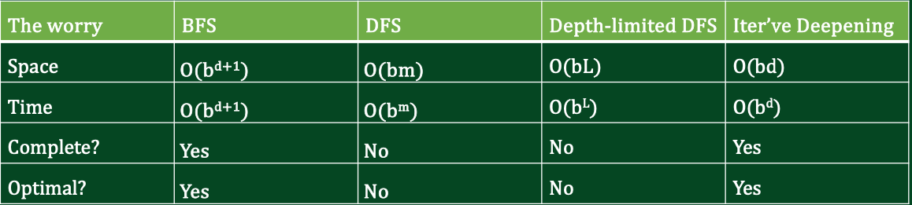

Intelligence can be thought of approximately as problem solving. That is to say, the tasks that make up how we think of intelligence can be boiled down generally to mapping some problem to a solution through a set of actions. 

From this, we discuss search, a core mechanism in problem solving.

# Agents and Environment
Agents and environments are fundamental components of AI systems. Hence, they're also involved in search.

- Agents: Anything that obtains information about the world and makes use of it
- Environment: The world in which the agent lives

# Problem Formulation
Before we can work to solve some given problem, we have to define it concretely first. We do so through a state space graph. The graph is composed of the following:
- Node: Abstract world configurations
- Arcs: The set of actions
- Starting state
- Goal test

# Process
The general process for search can defined as follows:
- Utilize a fringe to store nodes to check; initially defined with the starting state
- Check and expand routine - check whether the current node is the goal state, if not expand to find the successors of the current node

---
# Uninformed Search
We introduce 3 different algorithms for performing uninformed search, search in which we examine states with no additional information.
1) Breadth-First Search
2) Depth-First Search
3) Iterative Deepening

## Breadth-First Search
Search in which the order prioritized for going through the tree is breadth. 

- Nodes are searched level by level
- Uses a FIFO data structure, a queue

## Depth-First Search
Search in which the order prioritized for going through the tree is depth.

- Nodes are searched branch by branch
- Uses a LIFO data structure, a stack

*Note on BFS vs. DFS implementation*
- When performing uninformed search on a graph, where keeping track of visited nodes in necessary, there exists a difference between how redundancy needs to be handled. Whereas DFS can handle redundancy, only causing some extra memory expenditure, having redundant nodes in the fringe for BFS leads to possible overwriting a shorter path.

## Iterative Deepening
Search in which DFS is implemented with an iterative increase in depth. Leading to combined benefits of completeness, optimality, and memory efficiency.

---
# Informed Search
Unlike uninformed search, informed search utilizes heuristics in addition to algorithms. From these heuristics, we can produce good enough results in shorter time.

## Best-First Search
Search utilizing an evaluation function $f(n)$ to estimate goodness to find the best unexpanded node.

Special Cases:
- Greedy Best-First Search
- A* Search

### Greedy Best-First Search
Defines the evaluation function $f(n) = h(n)$, where $h(n)$ is the heuristic. 

- Nodes are searched based on estimate of goodness
- Estimates of goodness are sorted through a priority queue

### A* Search
Defines the evaluation function $f(n) = g(n) + h(n)$, also considering the cost from the current node to the next.

- Nodes are searched with a better evaluation function
- Estimates are sorted through a priority queue

## Adversarial Search
Search in which two or more agents work towards opposing goals.

