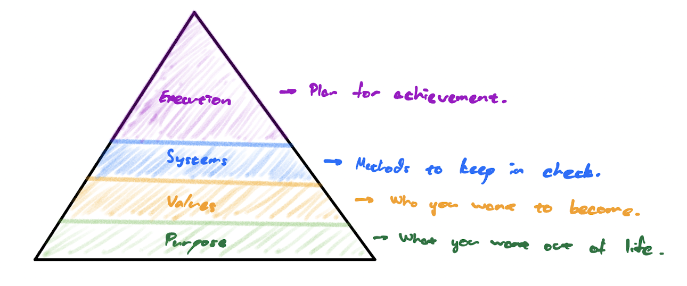

My framework for going about life. 

# Overview
A common answer when people respond to the question **“What is the purpose of life?”** is **“to be happy.”** But can't we be happy while being stagnant in life? Why is a life of working hard better than a life spending every waking hour playing video games or rotting in bed? What gives us reason to push forward? This framework was the outcome of experiencing this conflicting view firsthand.

After going through multiple sources regarding purpose and productivity, I settled on a framework for thinking about life through a pyramid composed of 4 levels. 

# Purpose
At the most fundamental level, it's necessary to figure out what we wish to get out of life. Without a driving force, I believe it's inevitable that there'll be times in which feelings of doubt for what we're working towards will sprout.

To derive a purpose, begin to look within yourself. While you may admire others and the lives they live, it's your inner voice which you have to pay attention to and form a connection with. To hear your inner voice, we need to reduce the external stimulation that's caused us to externalize our attention. 

The process of reducing external stimulation from sources such as social media or video games will certainly result in periods of boredom. During these times, keep in mind that your brain being bored is like a child complaining about not getting what they want. While counterintuitive, the brain doesn't fully know what's best for itself. 

# Values
With an idea of what we wish to get out of life, we can start to make this idea more tangible by thinking about what type of person we wish to become. 

Are there skills which you want to master?
What areas do you hope to become knowledgeable in?
How do you imagine your best possible future self?
Who do you wish to be surrounded by?

# Systems
After formulating our reasons for why, we can start to think about our actions and understanding for how. What do we need to understand about the pitfalls in trying to work towards where we want to go?

## Cutting Distractions
**Dopamine**
- Dopamine heavy activities increase the price you have to pay to experience joy.
- You need to work to satisfy biological drives (agency, identity, community, etc.)
	- Having easy sources of dopamine strip away this necessary work done by the brain

**Discipline**
- You don't have to work 100% of the time, your mind knows that's not possible. You do need to continuously put effort in.
- Don't be so caught up in one day that you lose sight of your whole life.
- Retain full consciousness of your actions.

**Consistency**
- Understand that you don't exist beyond today, you only live for this current moment in time.
- Inherit the life of the person who lived the day before you and serve the life of the person ahead of you.

## Emotion Regulation
**Motivation**
- Separate your actions from thoughts & emotions
- Question what about yourself, your identity, is so unwilling to do something.

**Happiness**
- $Happiness = \frac{Haves}{Wants}$
- Decrease what you want vs. increasing what you have by practicing gratitude.
- Extend the period of contentment for the things you obtain, increasing the window of reflection.

**Loneliness (When you're working by yourself)**
- Create emotionally salient/charged experiences that build your relationship with yourself. Find something challenging or new.
- Create things - either some small project or contributing towards something.
- Look to hobbies (reading, exercising, sports, cooking, etc.)

